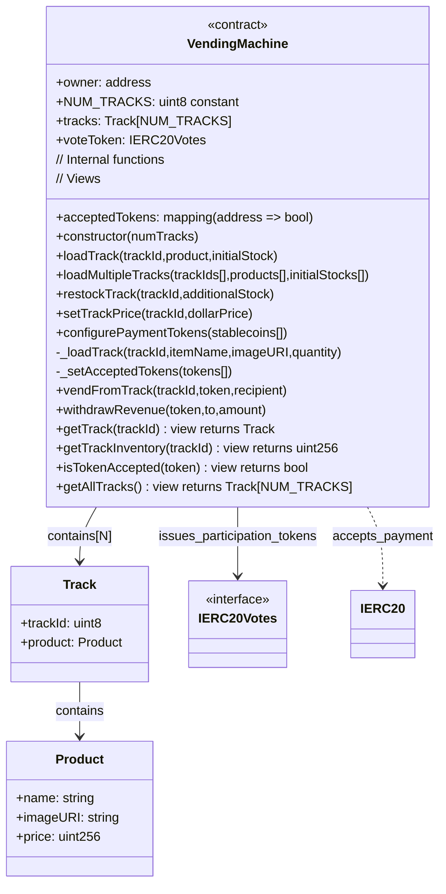
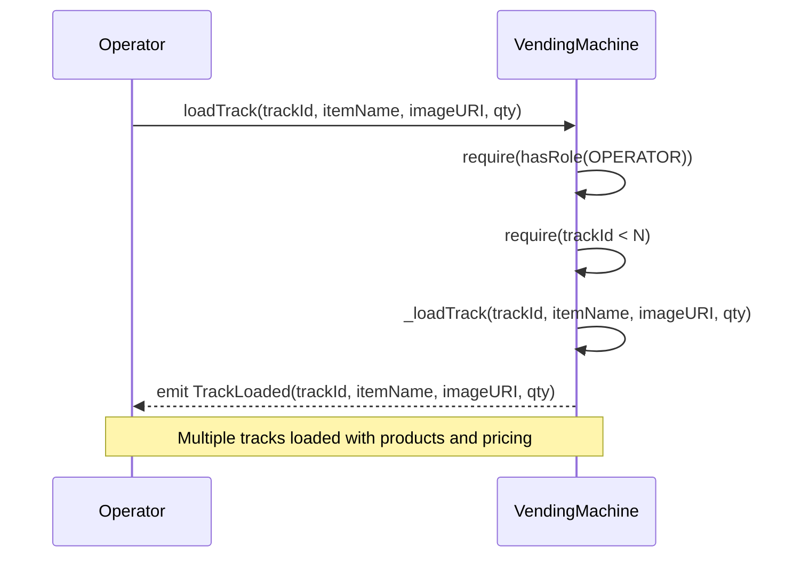
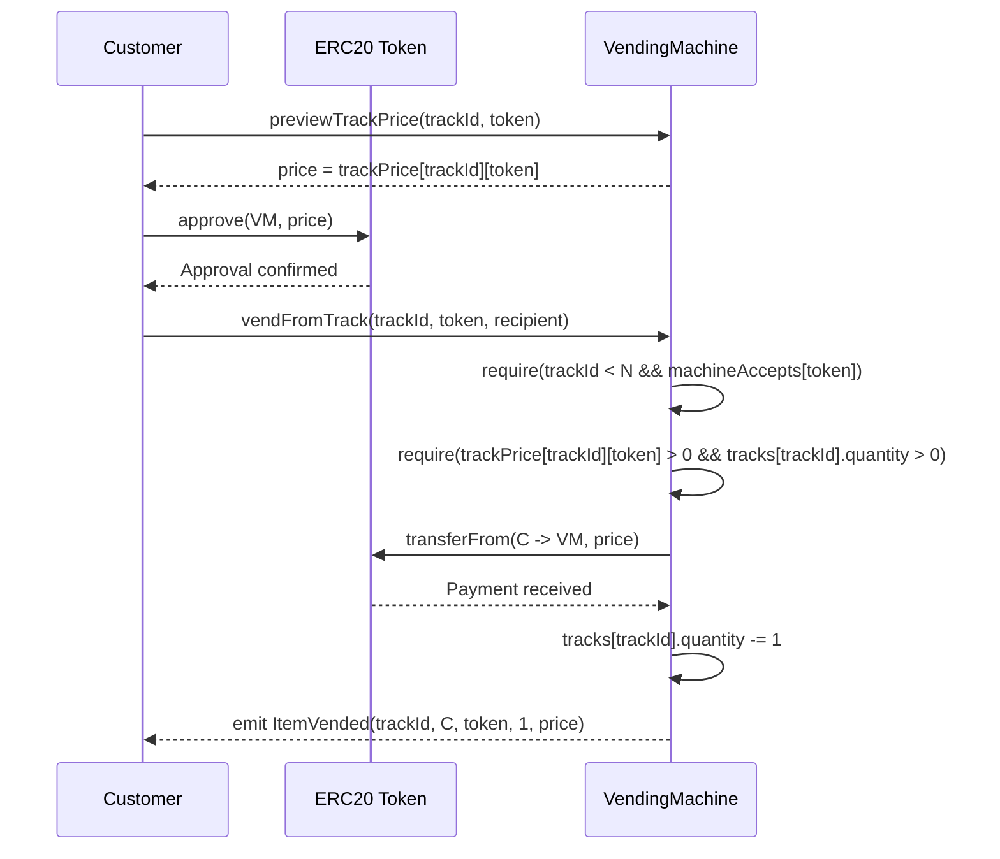
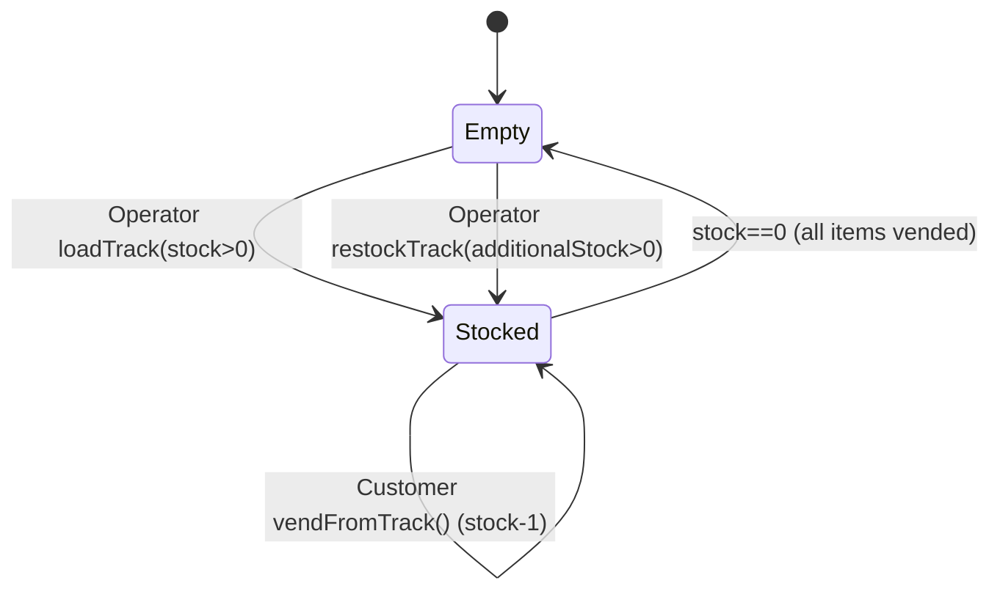

# Smart Contract Vending Machine

# Technical Spec (For Single Feature/Issue)

## 1. Background

**Problem Statement:**
Communities and organizations need a trust-minimized vending machine solution that accepts stablecoin payments without centralized processors. The solution must maintain accurate on-chain inventory with sequential dispensing mechanics and provide participation tokens to customers proportional to their purchase amounts.

**Context / History:**
Traditional vending machines rely on centralized payment systems and off-chain inventory tracking with no transparency. Existing crypto solutions lack the sequential dispensing mechanics and deterministic purchase flows of physical vending machines.

**Stakeholders:**

- Customers — purchase items from specific tracks using allowlisted tokens and earn participation tokens proportional to spending.
- Operator (permissioned) — loads items into tracks, sets per-track pricing, manages token allowlist.
- Owner/Treasury — withdraws revenue, sets roles.
- Token Holders — customers who earned participation tokens through purchases, have voting rights proportional to their usage.
- Vending Machine Interface — displays track contents, shows prices per track, guides payment & vending flow, shows participation token balances.

## 2. Motivation

**Goals & Success Stories:**

- Deterministic sequential vending: if track has items and payment is correct, next item in sequence is dispensed automatically.
- Minimal operator intervention: only track restocking & pricing require manual management.
- Clear vending events & cheap track inventory queries for vending machine interface.

**Value Proposition:**

- Transparent track inventory & pricing visible on blockchain.
- Stablecoin payments: accept multiple dollar-denominated tokens (USDC, USDT, DAI).
- Participation record: issue ERC20 votes tokens proportional to customer purchase amounts.
- Easy vending machine integration: track-based queries + standardized events.
- Flexible operator management: separate track loading and pricing operations for better control.

## 3. Scope and Approaches

**In Scope**

- Operator track management with separate operations (load identical products into tracks, then set per-track dollar pricing).
- Per-product pricing with stablecoin payments (price stored in product struct).
- N-track sequential dispensing system with configurable number of tracks and automatic front-item vending of identical products.
- Machine-wide dollar-denominated stablecoin allowlist management with batch configuration.
- Vending flow (single item per transaction from specified track), automatic sequential dispensing, payment custody.
- Events for all transactions; convenience view methods for track-based vending machine interface.

**Non-Goals**

- Multi-item purchases/bundles (explicitly prohibited - vending machines dispense one item at a time from one track).
- Custom track configurations (fixed at N tracks defined in constructor).
- Non-sequential dispensing (items must dispense from front of track in order).
- Price conversions (all stablecoins assumed to be $1.00 USD; operator sets dollar prices per track).
- Platform fees or revenue sharing (will be supported in future versions using participation tokens for fee distribution).
- Refunds/returns, shipping, KYC, tax logic.
- NFTs, loyalty points, or physical item dispensing automation.
- Fee-on-transfer token support (v1 assumes standard ERC-20 transferFrom).

**Technical Functionality / Reasoning / Tradeoffs**

| Technical Functionality | Reasoning for Being (Off) Scope | Tradeoffs |
|-------------------------|--------------------------------|-----------|
| Per-product pricing | Each product has its own price; flexible pricing model | Operator must set price for each product |
| Batch track loading | Load multiple tracks in single transaction; gas efficient | More complex function signature and validation |
| Single item sequential vending per track | Mimics physical vending machine tracks; keeps logic simple and gas-efficient | No bulk purchasing; customers must make separate transactions; items dispense in fixed order |
| Separate track operations | Flexible track management; load first, then price separately | More transactions required; operator must manage sequencing |
| Standard ERC-20 only | Predictable accounting | Fee-on-transfer tokens may fail |
| ReentrancyGuard | Protects vending & withdraw | Slight gas overhead |

**Alternative Approaches**

| Technical Functionality | Pros | Cons |
|-------------------------|------|------|
| Dynamic pricing | Automatic price updates | External dependencies, complexity |
| Off-chain inventory + proofs | Cheaper gas, rich queries | Requires trust/attestations |
| NFT-per-SKU/voucher | Composable, secondary markets | More complex flows, higher gas |
| Multi-track simultaneous dispensing | Fewer tx for customers | Complex track synchronization/partial fulfillment handling (not supported by design) |

**Relevant Metrics**

- Vending success rate per track (no. of successful purchases / attempts).
- Transaction failure breakdown per track (track empty, token not accepted, price not set, insufficient payment allowance).
- Track empty rate & average restocking duration per track.
- Operator response time (track restocking/pricing update latency).
- Items dispensed per track vs remaining inventory.
- Revenue held vs withdrawn by owner.

## 4. Step-by-Step Flow

### 4.1 Main ("Happy") Paths

**A) Operator loads single vending machine track**

- Pre-condition: Caller is owner or authorized operator.
- Action: loadTrack(trackId, product, initialStock) - configure single track with product (name, imageURI, price) and initial stock level.
- Validations: trackId is valid; product.name non-empty; initialStock > 0; product.price > 0.
- Persist/Emit: Save track with product details (name, imageURI, price), set initial stock separately, emit TrackLoaded.
- Post-condition: Track configured with product details and initial stock; ready for customer purchases.

**A2) Operator loads multiple tracks (batch operation)**

- Pre-condition: Caller is owner or authorized operator.
- Action: loadMultipleTracks(trackIds[], products[], initialStocks[]) - configure multiple tracks in single transaction.
- Validations: Arrays must be same length; all trackIds valid; all product.names non-empty; all initialStocks > 0; all product.prices > 0.
- Persist/Emit: Save all tracks with their product details, emit TrackLoaded for each track.
- Post-condition: All specified tracks configured and ready for customer purchases; gas-efficient bulk operation.

**B) Customer purchases single item from specific track**

- Pre-condition: Stablecoin t is accepted by machine; track has stock > 0; customer approved payment = 1 stablecoin unit; only one item can be purchased per transaction.
- Action: vendFromTrack(trackId, stablecoin, recipient) calls transferFrom(customer → contract, dollarAmount); dispense next identical product from front of track.
- Validations: trackId valid (0-2); stablecoin accepted by machine; track stock > 0; dollar price set; sufficient payment approval; non-reentrant; single item vending only.
- Persist/Emit: Decrement track stock by 1; emit ItemVended(trackId, customer, stablecoin, 1, dollarAmount).
- Post-condition: Payment held; next identical product dispensed from track; track stock reduced by 1.

**C) Owner withdraws vending machine revenue**

- Pre-condition: Caller has OWNER/TREASURY role; destination provided.
- Action: withdrawRevenue(token, to, amount).
- Validations: Balance ≥ amount.
- Persist/Emit: ERC-20 transfer; emit RevenueWithdrawn(token, to, amount).

**D) Machine-wide payment token management**

- Pre-condition: Caller has OPERATOR/OWNER.
- Action: configurePaymentTokens(tokens[]) - set the complete list of payment tokens the vending machine accepts (replaces existing list).
- Validations: No zero addresses; no duplicate tokens in array.
- Persist/Emit: Clear existing accepted tokens, set new ones; emit TokenAcceptanceUpdated(token, true) for each new token.
- Post-condition: Machine's accepted payment methods completely replaced; only these tokens can be used for track pricing and customer purchases.

### 4.2 Alternate / Error Paths

| # | Condition | System Action | Suggested Handling |
|---|-----------|---------------|-------------------|
| A1 | Payment token not accepted by machine | Revert TokenNotAccepted() | Display: disable token option; show machine's accepted payment methods |
| A2 | Price not set for accepted token | Revert PriceNotSet() | Display: item not priced for selected token; show available pricing |
| A3 | Item out of stock | Revert InsufficientStock() | Display: show "SOLD OUT"; suggest alternative items |
| A4 | Insufficient payment allowance | Revert from ERC-20 | Display: prompt customer to approve exact payment amount |
| A5 | Item unavailable | Revert ProductInactive() | Display: hide item or show "temporarily unavailable" |
| A7 | Fee-on-transfer token | Underpayment / revert | Document unsupported payment tokens v1 |
| A8 | Arithmetic overflow/underflow | Revert | Use checked math/solc ≥0.8.20 |

## 5. UML Diagrams (Mermaid)

### 5.1 Class Diagram

### 5.2 Sequence — Operator Load Track

### 5.3 Sequence — User Purchase

### 5.4 State — Track Lifecycle

## 5. Edge Cases & Concessions

- Fixed Track Count: NUM_TRACKS defined in constructor; no dynamic track creation or removal after deployment.
- Metadata: imageURI is unchecked; vending machine interface should sanitize/host safely.
- Vending Mishaps: Physical dispensing failures (double vend, no vend, stuck items) cannot be detected or resolved by smart contract; requires off-chain monitoring and manual intervention.
- Sybil Attack Vulnerability: Single customers can create multiple addresses to accumulate disproportionate participation tokens; no built-in identity verification or per-person limits.

## 6. Open Questions

- Do we need permit() (EIP-2612) flow to reduce approvals?

## 7. Glossary / References

- Accepted Stablecoin: Dollar-denominated ERC-20 address (USDC, USDT, DAI) marked as valid payment method for the entire vending machine (applies to all tracks).
- Track: One of N sequential dispensing channels representing a product type with trackId, name and imageURI, with dollar pricing applied to all accepted stablecoins.
- Operator: Address with permission to load tracks with identical products, set per-track dollar prices, manage machine-wide stablecoin list.
- Owner: Address authorized to withdraw vending machine revenue & manage operator roles.
