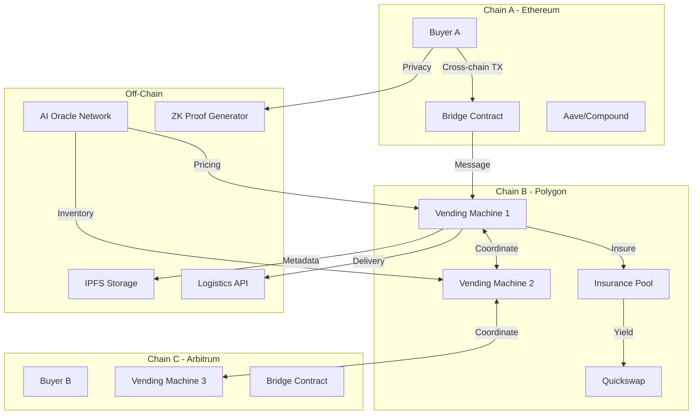
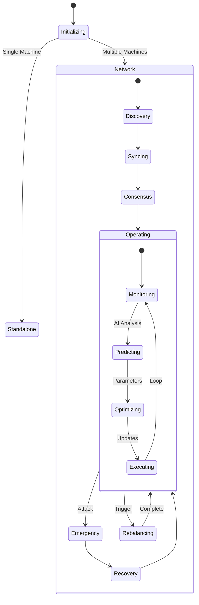
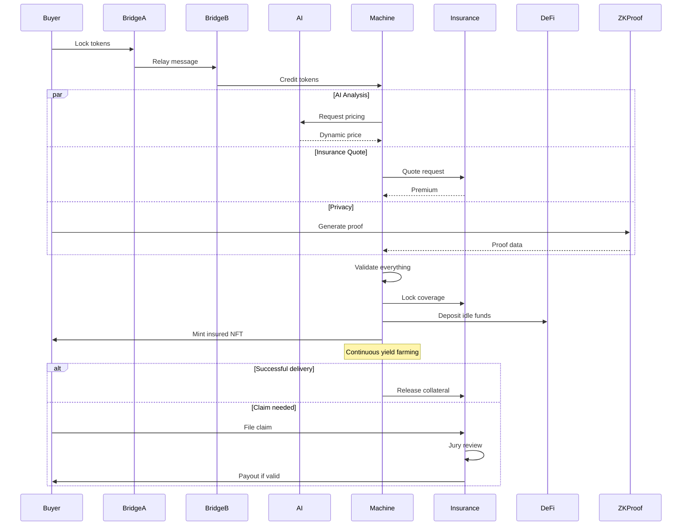
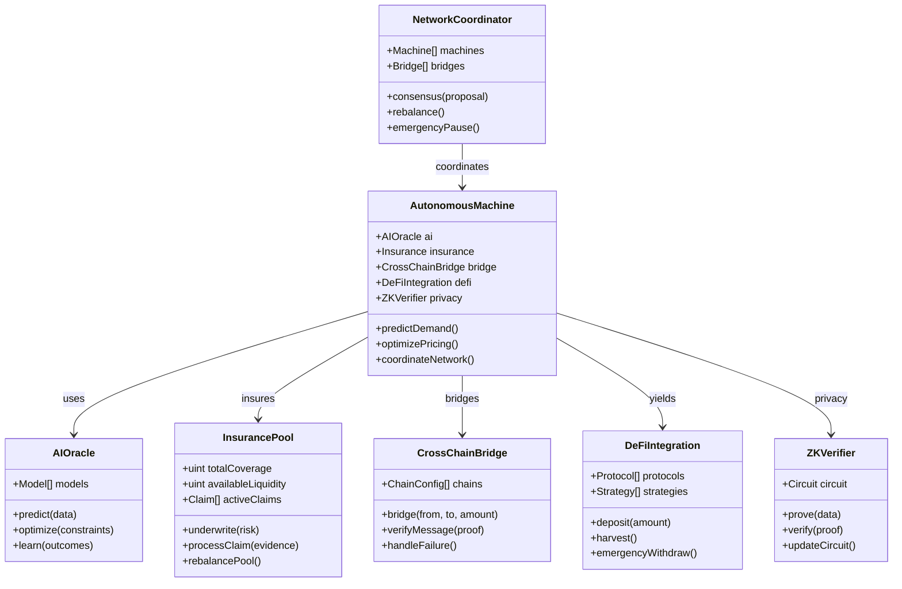

# Technical Spec - Blockchain Vending Machine (Endgame Scope)

## 1. Background

### Problem Statement
The physical goods economy lacks a fully autonomous, decentralized infrastructure that can operate across multiple chains, integrate with complex DeFi protocols, provide insurance mechanisms, and enable a network of interconnected vending machines with advanced AI-driven operations.

### Context / History
- Successful mid-range implementation with NFTs and reputation
- DeFi ecosystem maturity enabling complex integrations
- Cross-chain infrastructure improvements (bridges, messaging)
- AI/ML advances in autonomous operations
- Insurance protocol development for physical goods
- Network effects from multiple machine deployments
- Regulatory frameworks emerging for autonomous commerce

### Stakeholders
- **Global Sellers**: Cross-chain verified merchants
- **International Buyers**: Multi-chain users
- **Machine Network Operators**: Distributed node operators
- **Insurance Providers**: Risk underwriters
- **Liquidity Providers**: DeFi yield seekers
- **AI Oracles**: Autonomous decision systems
- **Regulatory Interfaces**: Compliance protocols
- **Hardware Manufacturers**: IoT device producers
- **Logistics Partners**: Delivery networks

## 2. Motivation

### Goals & Success Stories
- Fully autonomous machine network with AI governance
- Cross-chain interoperability for global commerce
- DeFi integration for lending, insurance, and yield
- Decentralized machine network with mesh coordination
- Predictive pricing and inventory management
- Zero-knowledge proof privacy for sensitive transactions
- Regulatory compliance automation
- Self-sustaining economic model with network effects

## 3. Scope and Approaches

### Non-Goals

| Technical Functionality | Reasoning for being off scope | Tradeoffs |
|------------------------|------------------------------|-----------|
| Physical machine manufacturing | Hardware complexity | Partner with manufacturers |
| Legal entity formation | Regulatory complexity | DAO wrapper structures |
| Fiat banking integration | Compliance overhead | Crypto-only rails |
| Supply chain management | Scope too broad | Focus on last-mile |
| Consumer credit systems | Regulatory risk | Cash-equivalent only |

### Value Proposition

| Technical Functionality | Value | Tradeoffs |
|------------------------|-------|-----------|
| Cross-chain operations | Global reach | Bridge risks |
| AI-driven pricing | Optimal revenue | Oracle dependency |
| Insurance protocols | Risk mitigation | Premium costs |
| Network coordination | Economies of scale | Complexity |
| Privacy features | Regulatory compliance | Gas overhead |
| DeFi composability | Yield generation | Smart contract risk |
| Autonomous operations | Minimal oversight | Edge case handling |

### Alternative Approaches

| Technical Functionality | Pros | Cons |
|------------------------|------|------|
| Centralized network | Simpler coordination | Single point of failure |
| Manual operations | Human oversight | Scalability limits |
| Single chain focus | Lower complexity | Limited reach |
| No insurance | Lower costs | Higher risk |

### Relevant Metrics
- Network transaction volume
- Cross-chain bridge utilization
- Insurance claim rates
- AI prediction accuracy
- DeFi yield generation
- Network effect multipliers
- Regulatory compliance scores
- Autonomous operation uptime

## 4. Step-by-Step Flow

### 4.1 Main ("Happy") Path

**Cross-Chain Purchase with Insurance:**
1. **Pre-condition**: Buyer on Chain A, Machine on Chain B
2. Buyer initiates cross-chain purchase via bridge
3. AI Oracle provides:
   - Dynamic pricing recommendation
   - Risk assessment
   - Insurance quote
4. System executes:
   - Bridge tokens from Chain A to B
   - Purchase insurance coverage
   - Lock collateral in insurance pool
   - Execute ZK-proof for privacy
5. Machine network coordinates:
   - Inventory verification across network
   - Optimal fulfillment routing
   - Logistics partner notification
6. DeFi integration:
   - Unused funds to yield protocols
   - Insurance premiums to coverage pools
   - Liquidity provision rewards
7. **Post-condition**: Insured NFT on buyer's chain, yields accumulating

**Autonomous Network Operations:**
1. **Pre-condition**: Network of N machines operational
2. AI system continuously:
   - Monitors demand patterns
   - Predicts inventory needs
   - Optimizes pricing curves
   - Rebalances liquidity
3. Network consensus:
   - Validates AI recommendations
   - Votes on parameter updates
   - Distributes rewards
4. Automatic execution:
   - Inventory transfers between machines
   - Price adjustments
   - Fee rebalancing
   - Yield harvesting
5. **Post-condition**: Self-optimizing network state

**Insurance Claim Process:**
1. **Pre-condition**: Buyer holds insured NFT
2. Buyer initiates claim with evidence
3. Decentralized jury (Kleros-style):
   - Reviews evidence
   - Votes on validity
   - Stakes reputation
4. If approved:
   - Insurance payout from pool
   - Seller reputation impact
   - Network learns from incident
5. **Post-condition**: Claim resolved, system adapted

### 4.2 Alternate / Error Paths

| # | Condition | System Action | Suggested Handling |
|---|-----------|---------------|-------------------|
| A1 | Bridge failure | Timeout and refund | Retry alternative bridge |
| A2 | AI oracle manipulation | Consensus override | Fallback to manual |
| A3 | Insurance pool drained | Pause new coverage | Emergency liquidity |
| A4 | Network partition | Local operation mode | Reconcile when healed |
| A5 | Regulatory block | Geo-fence transaction | Route through compliant path |
| A6 | DeFi protocol hack | Emergency withdrawal | Insurance claim |
| A7 | Privacy proof failure | Reject transaction | Standard flow fallback |
| A8 | Coordinated attack | Circuit breaker | DAO emergency response |

## 5. UML Diagrams

### Architecture Diagram

### State Machine - Network Coordination

### Sequence Diagram - Cross-Chain Insurance Purchase

### Class Diagram - Full System

## 5. Edge Cases and Concessions

- **Network Splits**: Machines may operate independently during partitions
- **AI Hallucinations**: Human override mechanisms remain necessary
- **Bridge Hacks**: Multi-sig emergency pause across all chains
- **Insurance Insolvency**: Graduated claim payments based on pool health
- **Regulatory Changes**: Modular compliance layer for adaptability
- **Mass Liquidation Events**: Circuit breakers on DeFi positions
- **Privacy vs Compliance**: Selective disclosure for regulatory requirements
- **Coordinated Network Attack**: Reputation slashing and network exclusion
- **Cross-chain Race Conditions**: Pessimistic locking with timeout
- **Quantum Computing Threat**: Upgradeable cryptography modules

## 6. Open Questions

- Optimal network size for decentralization vs efficiency?
- AI model training: Centralized or federated learning?
- Bridge selection: Build custom or integrate existing?
- Insurance model: Mutual or commercial underwriting?
- Privacy level: Full ZK or selective disclosure?
- DeFi strategy: Conservative or aggressive yield farming?
- Regulatory approach: Proactive compliance or reactive?
- Network token: New token or use existing?
- Hardware specs: Minimum viable machine requirements?
- Disaster recovery: Hot standby or cold backup strategy?

## 7. Glossary / References

- **Cross-chain Bridge**: Infrastructure for token/message transfer between blockchains
- **AI Oracle**: External service providing AI/ML predictions to smart contracts
- **ZK-Proof**: Zero-knowledge cryptographic proof for privacy
- **DeFi Composability**: Ability to combine multiple DeFi protocols
- **Network Coordination**: Distributed consensus among machine operators
- **Insurance Pool**: Collective risk-sharing mechanism
- **Federated Learning**: Distributed AI training without data centralization
- **Circuit Breaker**: Emergency pause mechanism for critical failures
- **Mesh Network**: Peer-to-peer machine communication topology
- **Selective Disclosure**: Revealing specific data while maintaining privacy

Links:
- [LayerZero Cross-chain Messaging](https://layerzero.network/)
- [Chainlink AI Oracles](https://chain.link/)
- [Nexus Mutual Insurance](https://nexusmutual.io/)
- [ZK-SNARK Circuits](https://z.cash/technology/zksnarks/)
- [DeFi Composability Patterns](https://ethereum.org/en/defi/)
- [Kleros Decentralized Courts](https://kleros.io/)
- [IPFS Distributed Storage](https://ipfs.io/)
- [Federated Learning Framework](https://www.tensorflow.org/federated)
- [EIP-4337 Account Abstraction](https://eips.ethereum.org/EIPS/eip-4337)
- [Cross-chain Risk Framework](https://jumpcrypto.com/cross-chain-risk-framework/)