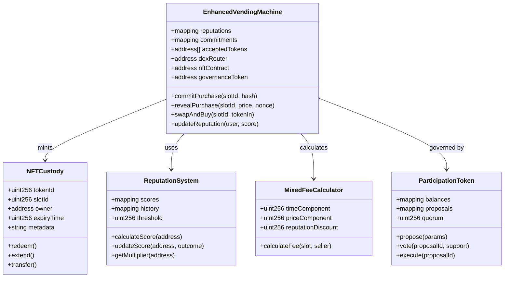
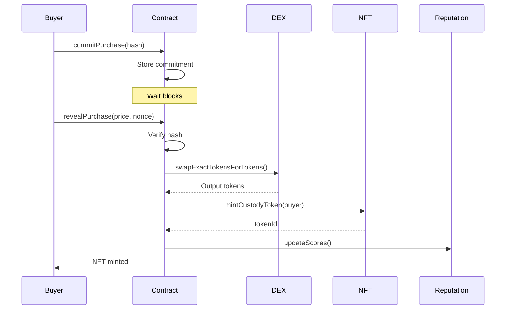
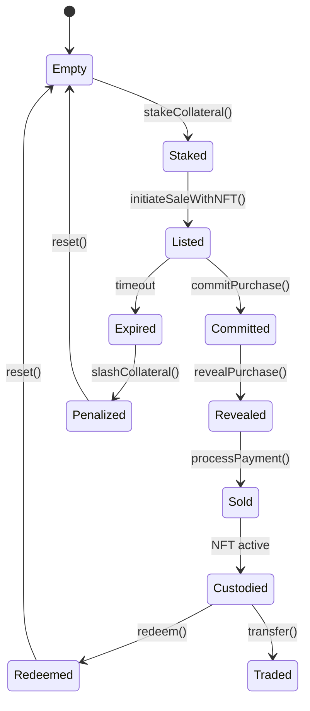

# Technical Spec - Blockchain Vending Machine (Mid-Range Scope)

## 1. Background

### Problem Statement
Physical goods marketplaces lack decentralized infrastructure with advanced pricing mechanisms, reputation systems, and tokenized ownership rights. Current solutions don't provide sufficient security guarantees or flexible fee structures for sustainable operations.

### Context / History
- MVP implementation of basic vending machine DAO
- Growing demand for NFT-backed physical goods
- DeFi protocols enabling advanced financial primitives
- Reputation systems in decentralized marketplaces
- Mixed fee models balancing time and price incentives

### Stakeholders
- **Sellers**: Verified goods providers with reputation
- **Buyers**: Token holders with purchase history
- **Machine Operators**: DAO token holders
- **Participation Token Holders**: Governance participants
- **Frontend**: Enhanced stateless interface
- **Oracle Services**: Price and reputation feeds

## 2. Motivation

### Goals & Success Stories
- Implement reputation system for quality assurance
- Enable NFT-based long-term custody rights
- Support multiple payment tokens via DEX integration
- Introduce mixed fee schedules for optimal revenue
- Add participation tokens for basic governance
- Implement front-running protection mechanisms

## 3. Scope and Approaches

### Non-Goals

| Technical Functionality | Reasoning for being off scope | Tradeoffs |
|------------------------|------------------------------|-----------|
| Full autonomous operation | Requires complex AI/ML | Semi-autonomous with override |
| Cross-chain support | Bridge complexity | Single chain deployment |
| Insurance protocols | Regulatory complexity | Basic dispute resolution only |
| Physical machine network | Infrastructure overhead | Single machine focus |
| Advanced DeFi strategies | Smart contract risk | Simple DEX swaps only |

### Value Proposition

| Technical Functionality | Value | Tradeoffs |
|------------------------|-------|-----------|
| Reputation system | Quality assurance | Gas costs for updates |
| NFT custody tokens | Ownership flexibility | Increased complexity |
| Mixed fee model | Optimized revenue | Complex calculations |
| Multi-token support | User flexibility | DEX dependency |
| Participation tokens | Decentralized governance | Coordination overhead |
| Commit-reveal buying | Front-running protection | Two-step process |

### Alternative Approaches

| Technical Functionality | Pros | Cons |
|------------------------|------|------|
| Centralized reputation | Lower gas costs | Trust assumptions |
| Physical custody only | Simpler implementation | No tokenization benefits |
| Fixed fee model | Predictable costs | Suboptimal revenue |
| Single token only | Simpler architecture | Limited user base |

### Relevant Metrics
- Seller reputation scores
- NFT trading volume
- Fee optimization efficiency
- Governance participation rate
- Front-running prevention success rate
- Multi-token transaction distribution

## 4. Step-by-Step Flow

### 4.1 Main ("Happy") Path

**Enhanced Buy Flow with Commit-Reveal:**
1. **Pre-condition**: Buyer has tokens, slot active, reputation checked
2. Buyer commits hash: `commitPurchase(slotId, hash(price + nonce))`
3. Wait for commit period (1-2 blocks)
4. Buyer reveals: `revealPurchase(slotId, price, nonce)`
5. System validates:
   - Commitment matches reveal
   - Price is current
   - Token balance sufficient
   - Seller reputation threshold met
6. System executes:
   - Token swap if needed (via DEX)
   - Transfer payment with mixed fees
   - Mint NFT custody token
   - Update reputation scores
7. **Post-condition**: Buyer owns NFT, can redeem or trade

**Enhanced Sell Flow with Reputation:**
1. **Pre-condition**: Seller has reputation ≥ threshold
2. Seller stakes collateral: `stakeCollateral(amount)`
3. Seller initiates: `initiateSaleWithNFT(params, metadata)`
4. System validates:
   - Reputation score
   - Collateral amount
   - Metadata validity
5. System creates:
   - NFT template for item
   - Mixed fee schedule
   - Reputation-weighted pricing
6. **Post-condition**: Enhanced auction with NFT minting ready

**Governance Flow:**
1. **Pre-condition**: User holds participation tokens
2. User proposes: `createProposal(type, params)`
3. Token holders vote during voting period
4. System executes if quorum reached:
   - Fee adjustments
   - Reputation thresholds
   - Collateral requirements
5. **Post-condition**: Parameters updated

### 4.2 Alternate / Error Paths

| # | Condition | System Action | Suggested Handling |
|---|-----------|---------------|-------------------|
| A1 | Low reputation seller | Block listing | Require reputation building |
| A2 | Commit-reveal mismatch | Reject reveal | Retry with correct values |
| A3 | DEX swap fails | Revert transaction | Try different token |
| A4 | NFT mint fails | Refund payment | Check metadata validity |
| A5 | Collateral insufficient | Block sale | Increase stake |
| A6 | Governance attack | Emergency pause | Admin intervention |
| A7 | Oracle failure | Use last known value | Wait for oracle recovery |

## 5. UML Diagrams

### Class Diagram

### Sequence Diagram - Commit-Reveal Purchase

### State Diagram - Enhanced Slot Lifecycle

## 5. Edge Cases and Concessions

- **MEV Protection**: Commit-reveal adds complexity but doesn't eliminate all MEV
- **Reputation Gaming**: Sybil attacks possible despite mitigation measures
- **NFT Liquidity**: Secondary market may be thin initially
- **Oracle Dependence**: System vulnerable to oracle failures
- **Governance Attacks**: Token concentration could enable manipulation
- **Cross-token Arbitrage**: DEX integration may enable price manipulation
- **Custody Disputes**: Limited on-chain resolution for physical disputes

## 6. Open Questions

- Optimal commit-reveal timing to balance UX and security?
- Reputation algorithm parameters and decay rates?
- NFT metadata standards for physical goods?
- DEX integration: Uniswap V3 or custom AMM?
- Participation token distribution mechanism?
- Emergency pause conditions and recovery procedures?
- Integration with external reputation systems (Chainlink, The Graph)?

## 7. Glossary / References

- **Commit-Reveal**: Two-phase process to hide intentions until commitment
- **NFT Custody Token**: Non-fungible token representing ownership rights
- **Mixed Fee Model**: Combination of time-based and price-based fees
- **Reputation System**: Score-based trust mechanism
- **Participation Token**: Governance token for voting rights
- **DEX Router**: Decentralized exchange interface for token swaps
- **Collateral Staking**: Security deposit by sellers
- **Sybil Attack**: Creating multiple identities to game reputation

Links:
- [ERC-721 NFT Standard](https://eips.ethereum.org/EIPS/eip-721)
- [Uniswap V3 Documentation](https://docs.uniswap.org/)
- [Commit-Reveal Schemes](https://github.com/ethereum/wiki/wiki/Commit-Reveal)
- [Reputation Systems Research](https://arxiv.org/abs/1811.08615)
- [DAO Governance Patterns](https://arxiv.org/abs/2102.10096)