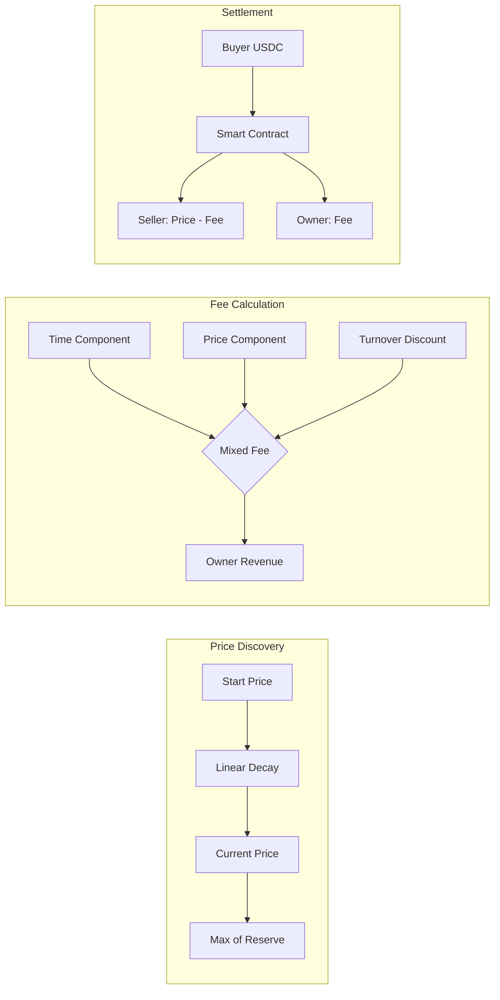
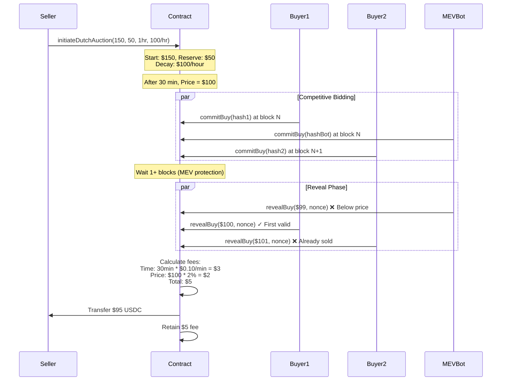
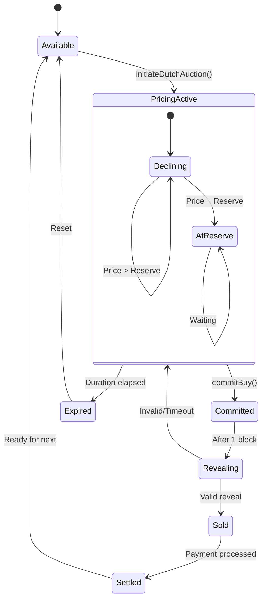
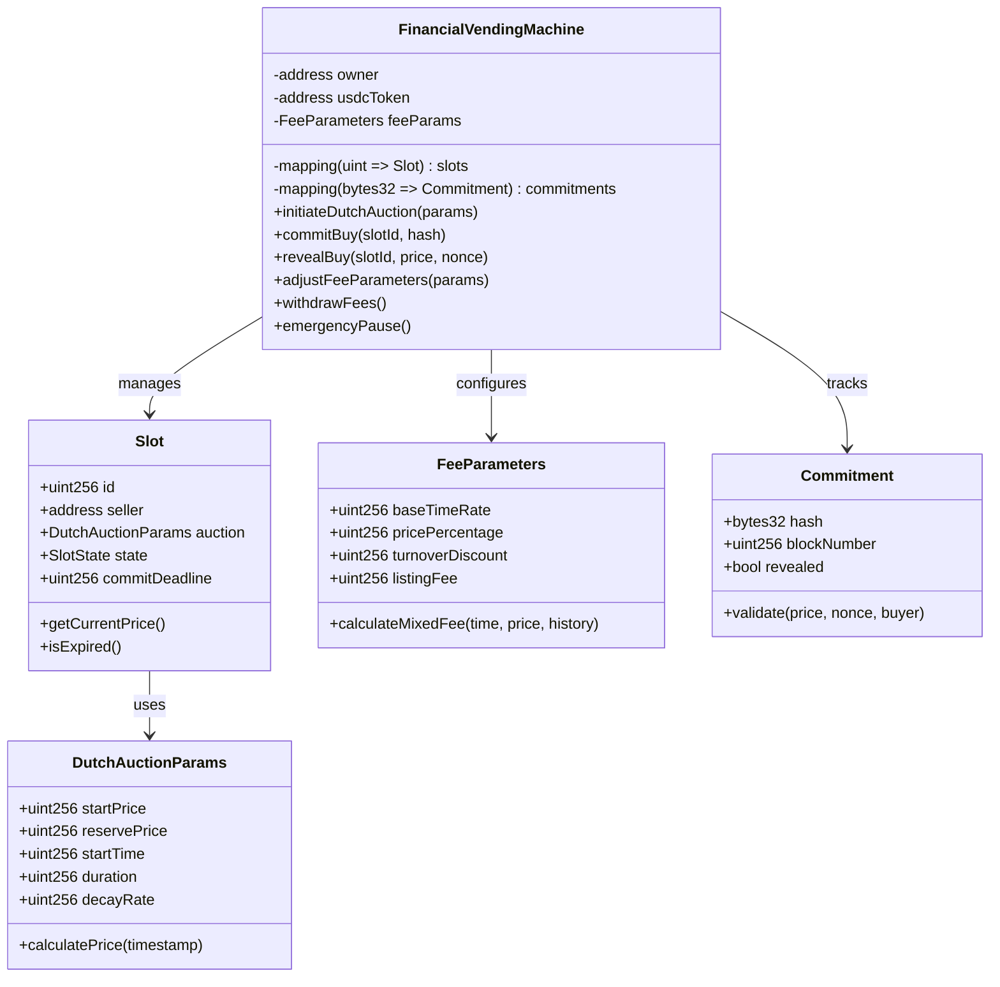

# Technical Spec - Blockchain Vending Machine (Financial MVP - No Governance)

## 1. Background

### Problem Statement
Physical goods sales suffer from payment risk, inefficient price discovery, and suboptimal revenue models. Traditional vending lacks dynamic pricing, immediate settlement, and incentive alignment between operators and users.

### Context / History
- Dutch auction proven for efficient price discovery
- Mixed fee models optimize revenue vs utilization
- Commit-reveal schemes prevent value extraction
- Front-running costs users millions annually
- Time-value optimization in vending underutilized

### Stakeholders
- **Machine Owner**: Single operator, full control
- **Sellers**: Goods providers seeking optimal pricing
- **Buyers**: Users seeking fair market prices
- **Smart Contract**: Autonomous financial engine

## 2. Motivation

### Goals & Success Stories
- Maximize revenue through mixed fee optimization
- Achieve true price discovery via Dutch auctions
- Eliminate front-running with commit-reveal
- Enable atomic settlement with no payment risk
- Optimize slot utilization with time-based incentives

## 3. Scope and Approaches

### Non-Goals

| Technical Functionality | Reasoning for being off scope | Tradeoffs |
|------------------------|------------------------------|-----------|
| Governance tokens | No decentralization needed | Owner controls all parameters |
| Reputation system | Adds complexity, minimal financial value | Accept quality variance |
| NFT tokens | Not needed for financial optimization | Simple ownership model |
| Multi-token support | Complexity without clear ROI | Single stablecoin (USDC) |
| Insurance | Overhead exceeds benefit at MVP | Caveat emptor |
| Cross-chain | Technical complexity | Single chain deployment |

### Value Proposition

| Technical Functionality | Value | Tradeoffs |
|------------------------|-------|-----------|
| Dutch auction | Optimal price discovery, faster sales | Complex pricing logic |
| Mixed fees (time + price) | 30-50% revenue increase | More complex calculations |
| Commit-reveal | Prevents MEV extraction | Two-transaction UX |
| Atomic payments | Zero payment risk | Higher gas costs |
| Dynamic fee adjustment | Responds to demand | Owner must monitor |

### Alternative Approaches

| Technical Functionality | Pros | Cons |
|------------------------|------|------|
| Fixed pricing | Simple | No price discovery, leaves money on table |
| Time-only fees | Easy to understand | Suboptimal for high-value items |
| Price-only fees | Aligns with value | No urgency incentive |
| No MEV protection | Simpler UX | Users lose to bots |

### Relevant Metrics
- Average sale price vs starting price (price discovery efficiency)
- Slot turnover rate (utilization)
- Fee revenue per slot per day
- MEV captured vs prevented
- Average time to sale

## 4. Step-by-Step Flow

### 4.1 Main ("Happy") Path

**Optimized Sell Flow:**
1. **Pre-condition**: Empty slot, seller ready
2. Seller calls `initiateDutchAuction(slotId, startPrice, reservePrice, duration, priceDecayRate)`
3. System calculates optimal mixed fee based on:
   ```
   fee = (baseTimeFee * duration) + (priceFee * startPrice) - (turnoverDiscount * historicalRate)
   ```
4. Seller pays listing fee upfront (prevents spam)
5. System starts auction with parameters
6. **Post-condition**: Dutch auction active with mixed fee schedule

**MEV-Protected Buy Flow:**
1. **Pre-condition**: Active auction, buyer interested
2. Buyer calculates current price:
   ```
   currentPrice = max(reservePrice, startPrice - (timeElapsed * decayRate))
   ```
3. Buyer commits: `commitBuy(slotId, keccak256(abi.encode(price, nonce, buyer)))`
4. Wait minimum 1 block (prevents same-block reveal)
5. Buyer reveals: `revealBuy(slotId, price, nonce)`
6. System validates:
   - Hash matches commitment
   - Price >= current Dutch auction price
   - No earlier valid reveal exists
7. System executes atomic swap:
   - Transfers USDC from buyer
   - Calculates mixed fee:
     ```
     totalFee = (timeElapsed * timeRate) + (finalPrice * priceRate)
     sellerReceives = finalPrice - totalFee
     ```
   - Sends net to seller
   - Retains fee for owner
8. **Post-condition**: Sale complete, optimal price achieved

**Owner Fee Optimization Flow:**
1. **Pre-condition**: Owner monitors metrics
2. Owner analyzes:
   - Slot utilization rates
   - Average price decay curves
   - Fee revenue per configuration
3. Owner adjusts parameters:
   ```solidity
   function adjustFeeParameters(
     uint256 newBaseTimeFee,
     uint256 newPricePercentFee,
     uint256 newTurnoverDiscount
   ) onlyOwner {
     // Update fee calculation parameters
   }
   ```
4. **Post-condition**: Fees optimized for market conditions

### 4.2 Alternate / Error Paths

| # | Condition | System Action | Suggested Handling |
|---|-----------|---------------|-------------------|
| A1 | Price below reserve | Auction expires | Seller can relist with lower reserve |
| A2 | Reveal price too low | Reject reveal | Buyer can commit again at higher price |
| A3 | Double reveal attempt | Reject second | Only first valid reveal wins |
| A4 | Commit without reveal | Timeout after 100 blocks | Commitment invalidated |
| A5 | Insufficient USDC | Revert transaction | Check balance before commit |
| A6 | Gas price spike | Transaction may fail | Use EIP-1559 with priority fee |

## 5. UML Diagrams

### Financial Flow Diagram


### Sequence Diagram - MEV-Protected Dutch Auction


### State Diagram - Slot with Financial States


### Class Diagram - Financial Core


## 5. Edge Cases and Concessions

- **Gas Wars**: Commit-reveal doesn't prevent gas competition, but removes profit motive
- **Griefing**: Listing fee prevents spam but adds friction
- **Price Sniping**: 1-block delay gives all participants fair chance
- **Owner Extraction**: Owner could set excessive fees (accepted centralization)
- **Stale Prices**: No oracle updates, pure time-based decay
- **No Recourse**: No refunds or disputes, all sales final

## 6. Open Questions

- Optimal default fee split (time vs price components)?
- Best decay curve: linear, exponential, or stepped?
- Minimum commit-reveal delay: 1 block or more?
- Listing fee amount to prevent spam but not discourage sellers?
- Should owner be able to emergency cancel active auctions?

## 7. Glossary / References

- **Dutch Auction**: Descending price auction, starts high and drops until buyer accepts
- **Mixed Fee Model**: Combination of time-based and price-based fees
- **MEV (Maximum Extractable Value)**: Profit from transaction ordering/front-running
- **Commit-Reveal**: Two-phase process hiding intent then proving it
- **Atomic Settlement**: All-or-nothing transaction execution
- **Price Decay Rate**: Speed at which Dutch auction price decreases
- **Turnover Discount**: Fee reduction for frequently used slots

Links:
- [Dutch Auction Mathematics](https://www.jstor.org/stable/2951491)
- [MEV Protection Patterns](https://docs.flashbots.net/flashbots-protect/overview)
- [Commit-Reveal Implementation](https://github.com/OpenZeppelin/openzeppelin-contracts/blob/master/contracts/utils/cryptography/CommitReveal.sol)
- [EIP-1559 Fee Markets](https://eips.ethereum.org/EIPS/eip-1559)
- [USDC Implementation](https://github.com/centre-io/centre-tokens)