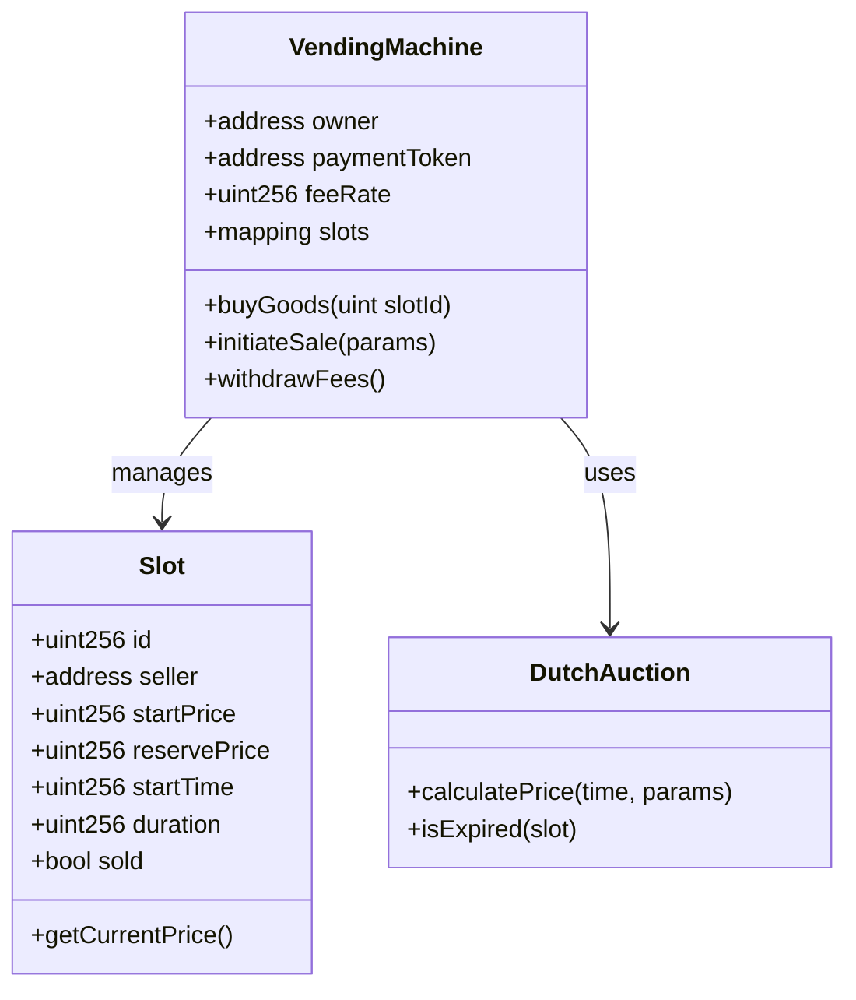
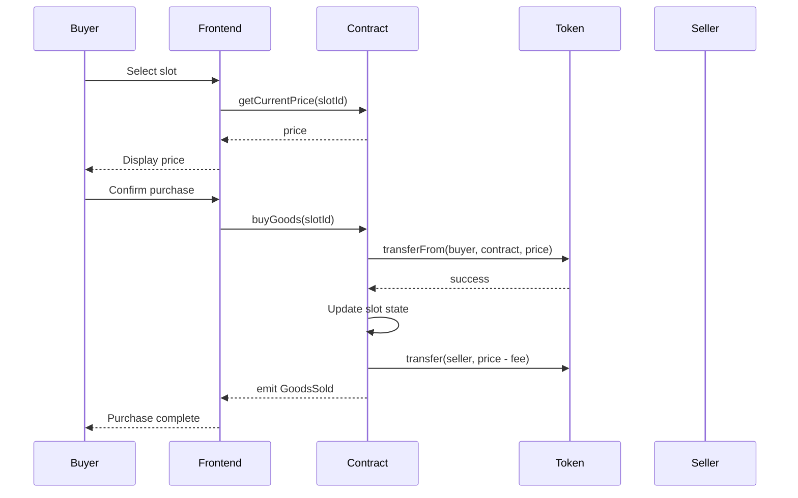
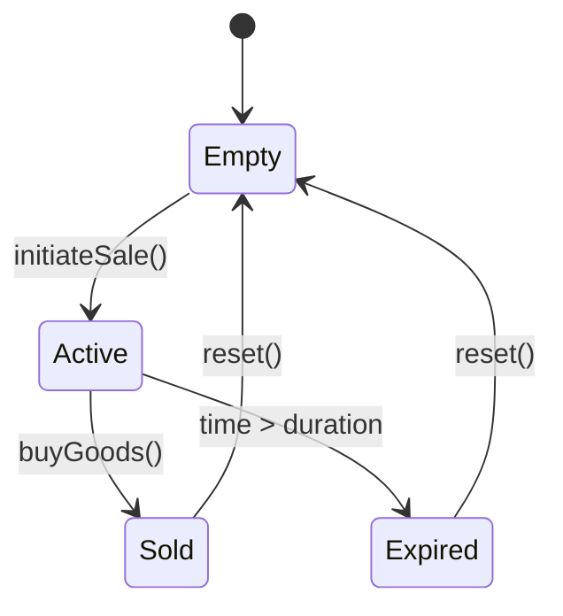

# Technical Spec - Blockchain Vending Machine (MVP Scope)

## 1. Background

### Problem Statement
Traditional vending machines require centralized payment processing, high transaction fees, and trusted intermediaries. Physical goods commerce lacks transparent, decentralized automation with counterparty risk mitigation.

### Context / History
- 2022 Basel research on blockchain-based vending machines
- Smart contract automation for physical goods (DAO concept)
- ERC-20/721 token standards for asset representation
- Dutch auction mechanisms for price discovery

### Stakeholders
- **Sellers**: Physical goods providers
- **Buyers**: Token holders seeking goods
- **Smart Contract**: Autonomous vending machine DAO
- **Frontend**: Stateless web interface

## 2. Motivation

### Goals & Success Stories
- Enable trustless physical goods transactions
- Automate price discovery via Dutch auction
- Eliminate intermediary payment processors
- Provide transparent, on-chain transaction history

## 3. Scope and Approaches

### Non-Goals

| Technical Functionality | Reasoning for being off scope | Tradeoffs |
|------------------------|------------------------------|-----------|
| Reputation system | Complex trust mechanics | Accept counterparty risk |
| Long-term custody NFTs | Requires physical infrastructure | Simple buy/sell only |
| DeFi integrations | Increases complexity | Focus on core vending |
| Multi-token support | Adds complexity | Single ERC-20 payment token |
| Participation tokens | Governance complexity | Centralized machine owner |

### Value Proposition

| Technical Functionality | Value | Tradeoffs |
|------------------------|-------|-----------|
| Dutch auction pricing | Automatic price discovery | May not reach optimal price quickly |
| Time-based fees | Simple fee structure | Less flexible than dynamic fees |
| Smart contract escrow | Eliminates payment risk | Gas costs for transactions |
| ERC-20 payments | Standard token interface | Single token limitation |

### Alternative Approaches

| Technical Functionality | Pros | Cons |
|------------------------|------|------|
| Fixed pricing | Simple implementation | No price discovery |
| English auction | May achieve higher prices | Slower transaction completion |
| Fiat payment gateway | Familiar to users | Requires centralization |

### Relevant Metrics
- Transaction volume per slot
- Average sale completion time
- Gas costs per transaction
- Fee revenue generated

## 4. Step-by-Step Flow

### 4.1 Main ("Happy") Path

**Buy Flow:**
1. **Pre-condition**: Slot contains goods, buyer has sufficient tokens
2. Buyer calls `buyGoods(slotId)` with current price
3. System validates:
   - Slot is occupied
   - Price matches current Dutch auction price
   - Buyer has sufficient token balance
4. System executes:
   - Transfers tokens from buyer to contract
   - Marks slot as sold
   - Emits `GoodsSold` event
5. **Post-condition**: Buyer owns goods, seller receives payment minus fees

**Sell Flow:**
1. **Pre-condition**: Slot is empty, seller has goods
2. Seller deposits goods in physical slot
3. Seller calls `initiateSale(slotId, startPrice, reservePrice, duration)`
4. System validates:
   - Slot is vacant
   - Parameters are valid
5. System persists:
   - Sale parameters
   - Auction start time
   - Emits `SaleInitiated` event
6. **Post-condition**: Dutch auction active for slot

### 4.2 Alternate / Error Paths

| # | Condition | System Action | Suggested Handling |
|---|-----------|---------------|-------------------|
| A1 | Insufficient tokens | Revert transaction | Display balance error |
| A2 | Slot already sold | Revert with "Sold" | Refresh UI state |
| A3 | Invalid price | Revert with price | Show current price |
| A4 | Auction expired | Mark as failed | Allow withdrawal |
| A5 | Gas limit exceeded | Transaction fails | Retry with more gas |

## 5. UML Diagrams

### Class Diagram

### Sequence Diagram

### State Diagram

## 5. Edge Cases and Concessions

- **Front-running protection**: Not implemented in MVP, accept MEV risk
- **Physical delivery**: Handled off-chain, trust-based
- **Dispute resolution**: No mechanism, caveat emptor
- **Multiple goods per slot**: Not supported, single item only
- **Dynamic fee adjustment**: Fixed fee rate, no governance

## 6. Open Questions

- Optimal Dutch auction parameters (duration, price curve)?
- Gas optimization strategies for storage?
- Integration with specific ERC-20 token?
- Physical machine location verification?

## 7. Glossary / References

- **Dutch Auction**: Descending price auction where price decreases over time
- **DAO**: Decentralized Autonomous Organization
- **MEV**: Maximum Extractable Value (front-running risk)
- **ERC-20**: Fungible token standard
- **Slot**: Physical compartment in vending machine

Links:
- [Original Research Paper](https://doi.org/10.1109/HICSS.2022)
- [ERC-20 Standard](https://eips.ethereum.org/EIPS/eip-20)
- [Dutch Auction Theory](https://en.wikipedia.org/wiki/Dutch_auction)