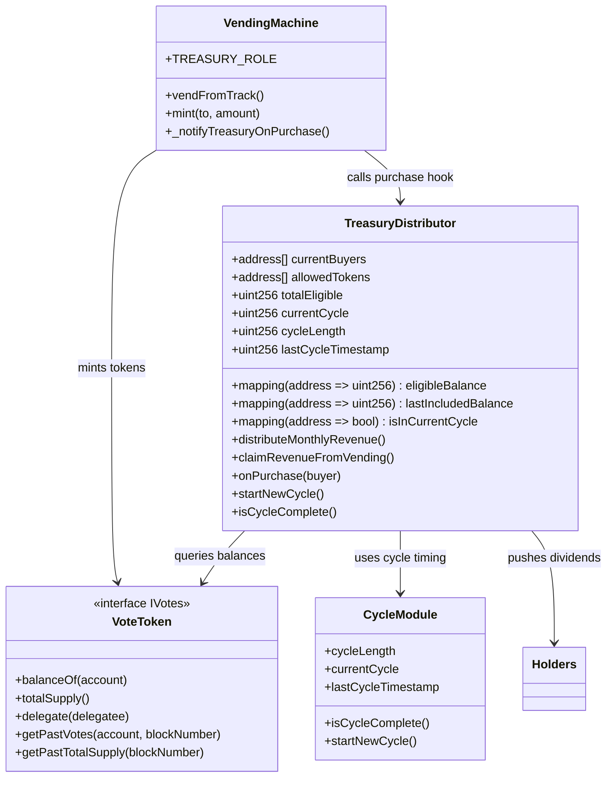
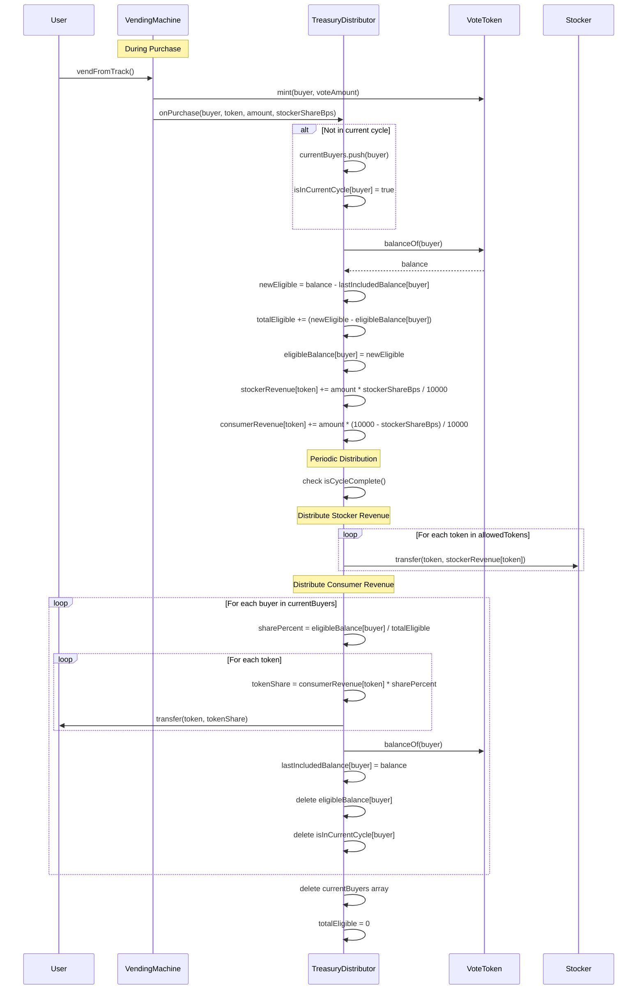
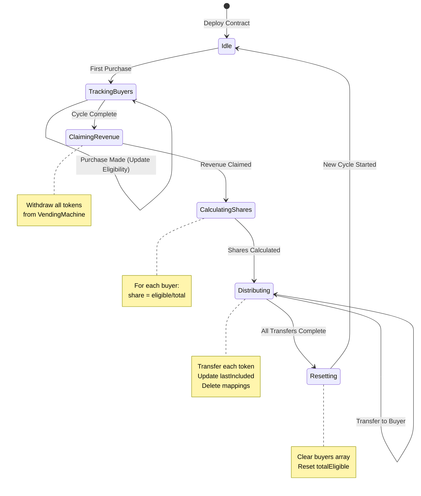

# Revenue Sharing & Dividend Distribution Technical Specification

## 1. Background

### Problem Statement
The vending machine generates revenue from product sales but lacks a mechanism to distribute profits to vote token holders proportionally to their holdings.

### Context / History
- Current system: VendingMachine.sol accepts stablecoin payments and mints VoteTokens to purchasers
- VoteToken implements ERC20Votes for governance capabilities
- Treasury can withdraw revenue but no automated distribution exists
- Permissioned roles: OPERATOR_ROLE, TREASURY_ROLE, DEFAULT_ADMIN_ROLE
- Each product can have different stockers and revenue share percentages

### Stakeholders
- Vote token holders (automatically receive dividends)
- Treasury contract (manages distributions via delegated role)
- Vending machine operators (maintain revenue flow)
- Product stockers (receive revenue share per product they stock)

## 2. Motivation

### Goals & Success Stories
- Enable periodic dividend distributions to vote token holders (configurable cycle length)
- Decentralize revenue share controls using existing role system delegated to contracts
- Automatic push-based distribution to all token holders
- Support multiple payment tokens (USDC, USDT, DAI)
- Gas-efficient distribution through purchase-time tracking and cycle-based arrays
- Flexible distribution schedules (weekly, bi-weekly, monthly, etc.)

## 3. Scope and Approaches

### Value Proposition

| Technical Functionality | Value | Tradeoffs |
|------------------------|-------|-----------|
| Push-based distribution | Automatic monthly payouts to all holders | Higher gas costs for distributor |
| Purchase-time tracking | Buyer eligibility tracked during vending | Minimal computation at distribution |
| Cycle-based buyer arrays | Efficient iteration of eligible recipients | Storage for buyer list per cycle |
| Balance snapshot mapping | Track (balance - cumulative) per cycle | Clean separation of cycles |
| Contract-based treasury | Decentralized control via smart contracts | Requires careful role delegation |

### Non-Goals
- Historical tracking onchain (offscope)
- Pull-based claiming mechanisms
- Governance voting on distribution amounts
- Tax reporting features
- Manual claim processes

## 4. Step-by-Step Flow

### 4.1 Main ("Happy") Path

**Periodic Distribution Process:**

1. **Pre-condition**: Revenue accumulated and pre-split in TreasuryDistributor, cycle complete
2. **Treasury Contract** detects cycle completion (time-based: `block.timestamp >= lastCycleTimestamp + cycleLength`)
3. **Distribute stocker revenue**:
   - For each stocker with revenue this cycle:
     - For each token in `allowedTokens`:
       - Transfer `stockerRevenue[stocker][token]` to stocker address
4. **System** iterates through `currentBuyers` array
5. **For each buyer**: 
   - Calculate share percentage = `eligibleBalance[buyer] / totalEligible`
   - For each token:
     - Transfer `consumerRevenue[token] * sharePercentage` to buyer
   - Update: `lastIncludedBalance[buyer] = voteToken.balanceOf(buyer)`
   - Delete: `eligibleBalance[buyer]` and `isInCurrentCycle[buyer]`
6. **System** resets for new cycle:
   - Clear `currentBuyers` array
   - Reset `totalEligible = 0`
   - Reset all `stockerRevenue[token] = 0` and `consumerRevenue[token] = 0`
7. **Post-condition**: All dividends distributed, new cycle begins

### 4.2 Purchase-Time Tracking System

**On Each VendingMachine Purchase:**
1. **VendingMachine** mints VoteTokens to buyer (standard ERC20Votes)
2. **VendingMachine** calls purchase hook on TreasuryDistributor with:
   - Buyer address
   - Payment token used
   - Payment amount
   - Product's `stockerShareBps`
   - Product's `stockerAddress`
3. **If not in current cycle**: 
   - Add buyer to `currentBuyers` array
   - Set `isInCurrentCycle[buyer] = true`
4. **TreasuryDistributor** queries `voteToken.balanceOf(buyer)` for current balance
5. **Calculate new eligible**: `newEligible = balance - lastIncludedBalance[buyer]`
6. **Update totals**:
   - `totalEligible = totalEligible - eligibleBalance[buyer] + newEligible`
   - `eligibleBalance[buyer] = newEligible`
7. **Split and track revenue**:
   - `stockerAmount = paymentAmount * stockerShareBps / 10000`
   - `consumerAmount = paymentAmount - stockerAmount`
   - `stockerRevenue[stockerAddress][token] += stockerAmount`
   - Track stocker in `stockersWithRevenue` array if new
   - `consumerRevenue[token] += consumerAmount`

Note: Revenue is pre-split at purchase time based on product configuration

### 4.4 Alternate / Error Paths

| # | Condition | System Action | Suggested Handling |
|---|-----------|---------------|-------------------|
| A1 | No revenue in cycle | Skip distribution | Start new cycle immediately |
| A2 | User eligible balance is zero | Skip user in distribution | No transfer needed |
| A3 | Failed transfer to holder | Log failure event | Continue with other holders |
| A4 | Cycle not complete | Reject distribution attempt | Wait for cycle completion |

## 5. Architecture Diagrams

### Class Diagram



### Contract Initialization

```solidity
// TreasuryDistributor constructor/initializer parameters
constructor(
    address _voteToken,
    address _vendingMachine,
    address[] memory _allowedTokens,
    uint256 _cycleLength        // Common values:
                               // 1 day: 86,400 seconds
                               // 1 week: 604,800 seconds  
                               // 2 weeks: 1,209,600 seconds
                               // 30 days: 2,592,000 seconds
                               // 90 days: 7,776,000 seconds
) {
    voteToken = IVoteToken(_voteToken);
    vendingMachine = IVendingMachine(_vendingMachine);
    allowedTokens = _allowedTokens;
    cycleLength = _cycleLength;
    lastCycleTimestamp = block.timestamp;
    currentCycle = 1;
}
```

### Data Structure Design

```solidity
// Updated Product struct in VendingMachine
struct Product {
    string name;
    string imageURI;
    uint256 stockerShareBps;                            // stocker's revenue share for this product (e.g., 2000 = 20%)
    address stockerAddress;                              // address that receives stocker share for this product
}

// TreasuryDistributor storage
address[] public currentBuyers;                                   // array of buyers for current cycle
address[] public stockersWithRevenue;                             // array of stockers with revenue in current cycle
mapping(address => uint256) public eligibleBalance;               // buyer => (balance - lastIncludedBalance)
mapping(address => uint256) public lastIncludedBalance;           // buyer => balance included in last distribution
mapping(address => bool) public isInCurrentCycle;                 // buyer => in current cycle array

address[] public allowedTokens;                                   // list of payment tokens (USDC, USDT, DAI)
mapping(address => mapping(address => uint256)) public stockerRevenue;  // stocker => token => amount
mapping(address => uint256) public consumerRevenue;               // token => consumer revenue accumulated in cycle
mapping(address => bool) public hasStockerRevenue;                // stocker => has revenue in current cycle
uint256 public totalEligible;                                     // sum of all eligible balances
uint256 public currentCycle;
uint256 public immutable cycleLength;                             // cycle duration in seconds (set at initialization)
uint256 public lastCycleTimestamp;                                // timestamp when current cycle started
```

### Sequence Diagram



### State Diagram



## 6. Security Considerations

- **Sybil Resistance**: Vending machine's physical constraints prevent token farming
- **Access Control**: Treasury role delegated to immutable contract
- **Integer Overflow**: Built-in Solidity 0.8.20+ protection
- **Failed Transfers**: Continue distribution even if individual transfers fail
- **Hook Security**: Only authorized contracts can trigger hooks
- **Cycle Integrity**: Time-based cycles using block.timestamp
- **Double Distribution Prevention**: Cumulative tracking ensures fairness

## 7. Gas Optimization

- **Purchase-Time Tracking**: Buyers pay for their own array addition
- **Pre-calculated Eligible Balances**: No balance lookups during distribution
- **Efficient Iteration**: Only iterate buyers who participated in cycle
- **Batch Processing**: Can process multiple transfers in single transaction
- **Storage Packing**: Optimize struct layouts for minimal storage slots

## 8. Testing Requirements

- Unit tests for buyer array management
- Integration tests with VendingMachine purchases
- Cycle completion and transition tests
- Edge cases: duplicate buyers, zero balances, transfers
- Gas consumption benchmarks for various buyer counts
- Multi-cycle distribution accuracy tests

## 9. Open Questions

- What cycle lengths should be supported? (e.g., 1 week, 2 weeks, 1 month, 3 months)
- Default stocker share percentage per product? (Range: 10-50% depending on product margins)
- Should there be min/max limits on stockerShareBps per product?
- Maximum buyers array size before needing pagination?
- Minimum distribution threshold to skip dust amounts?
- Gas funding mechanism for autonomous operation?
- Should DEX pools be excluded from distributions?
- Can product stocker shares be updated after initial configuration?
- Should cycle length be updatable after deployment or immutable?

## 10. Glossary

- **Cycle**: Fixed time interval between distributions (configurable at initialization)
- **Current Buyers**: Array of addresses that participated in current cycle
- **Eligible Balance**: Current token balance minus last included balance
- **Last Included Balance**: Token balance that was included in the last distribution
- **Product Stocker Share**: Per-product percentage of revenue for the stocker (stored in Product struct)
- **Stocker Revenue**: Accumulated stocker portion from all sales in a cycle
- **Consumer Revenue**: Accumulated consumer portion from all sales in a cycle
- **Total Eligible**: Sum of all eligible balances in current cycle
- **Allowed Tokens**: List of payment tokens accepted (USDC, USDT, DAI - all 1e18 decimals)
- **Purchase Hook**: Function called on vending machine sales
- **Push Distribution**: Automatic transfer without user action