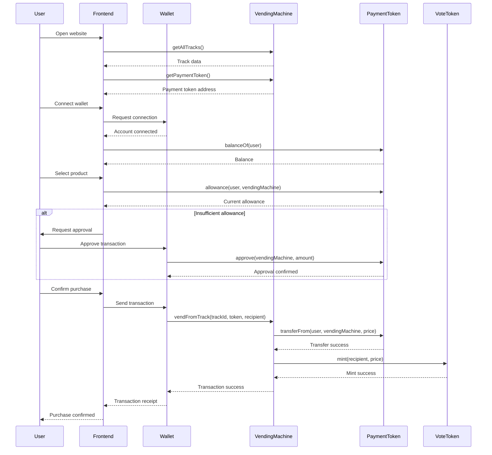
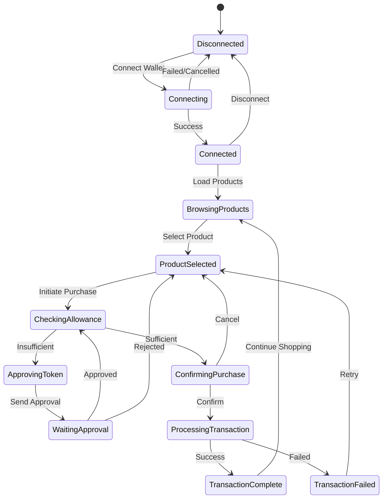
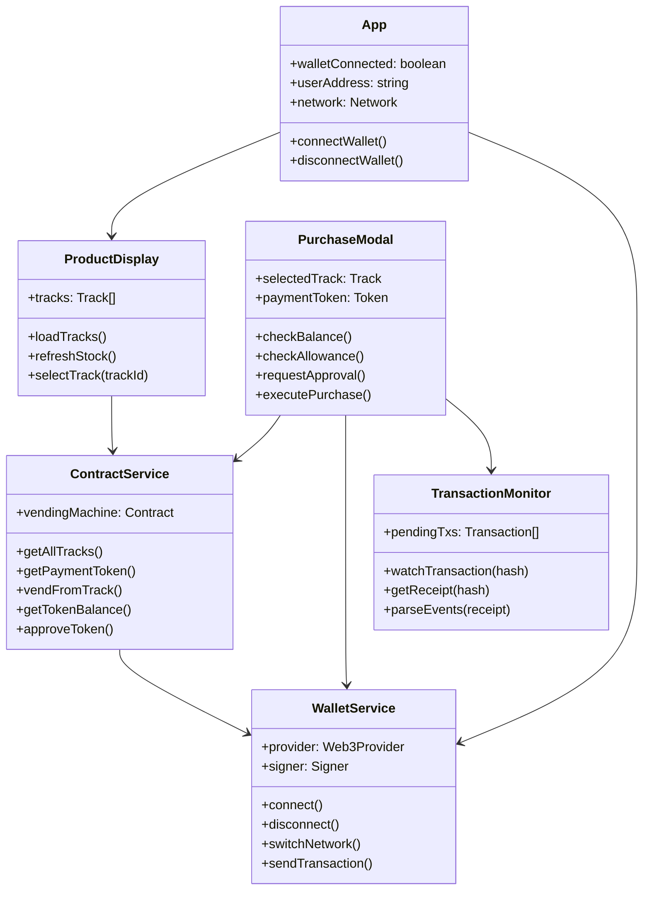

# Technical Spec: User Purchase Frontend for Vending Machine

## 1. Background

### Problem Statement
Users need a simple, intuitive interface to purchase items from the blockchain-based vending machine. The current smart contracts provide the infrastructure for vending operations, but there's no user-facing application that allows customers to browse products, select items, and complete purchases using the primary payment token.

### Context / History
- Smart contracts implemented: `VendingMachine.sol` with multi-track support
- Supports ERC20 token payments with a single configured payment token
- Issues vote tokens as rewards for purchases
- Contract deployed on Holesky testnet

### Stakeholders
- **End Users**: Customers purchasing from the vending machine
- **Machine Operators**: Need visibility into purchase activity
- **Smart Contracts**: VendingMachine, VoteToken, and ERC20 payment tokens
- **External Systems**: Blockchain RPC providers, wallet providers (MetaMask, WalletConnect)

## 2. Motivation

### Goals & Success Stories
1. **User can connect wallet** and see their token balances
2. **User can view all available products** with real-time stock levels
3. **User can select and purchase items** with the payment token
4. **User receives confirmation** of successful purchase and vote token rewards
5. **User can track transaction status** during processing

## 3. Scope and Approaches

### Non-Goals

| Technical Functionality | Reasoning for being off scope |
|------------------------|-------------------------------|
| Admin/Operator functions | Separate admin interface needed |
| Revenue withdrawal | Treasury operations out of scope |
| Product loading/restocking | Operator-only functions |
| Price management | Admin-only functionality |
| Token configuration | Admin-only functionality |
|| Multi-token payment support | Future enhancement - adds UI complexity |
| Historical purchase analytics | Future enhancement |

### Value Proposition

| Technical Functionality | Value | Tradeoffs |
|------------------------|-------|-----------|
| Web3 wallet integration | Users can connect any wallet | Requires wallet extension/app |
| Real-time stock display | Users see accurate availability | Requires blockchain polling |
| Single token payment | Simple, focused UX | Less payment flexibility |
| Transaction status tracking | Better UX during processing | Additional state management |
| Vote token balance display | Users see rewards earned | Extra contract calls |

### Alternative Approaches

| Technical Functionality | Pros | Cons |
|------------------------|------|------|
| Server-side transaction relay | Better error handling | Centralization, hosting costs |
| Client-side only (static site) | Fully decentralized, no server costs | Limited error recovery options |
| Hybrid with caching layer | Faster load times, reduced RPC calls | Infrastructure complexity |

### Relevant Metrics
- Transaction success rate
- Average transaction time
- Token approval conversion rate
- User session duration
- Error rate by type

## 4. Step-by-Step Flow

### 4.1 Main ("Happy") Path

**Purchase Flow:**

1. **Pre-condition**: User has wallet with payment token and sufficient balance
2. **User** opens the vending machine website
3. **System** loads and displays all tracks with products and stock levels
4. **User** connects wallet via MetaMask/WalletConnect
5. **System** validates connection and fetches user payment token balance
6. **User** selects a product track to purchase from
7. **System** displays product details and price in payment token
8. **User** confirms purchase
9. **System** checks token allowance
   - If insufficient: prompts for token approval
   - User approves token spend
10. **System** calls `vendFromTrack` with parameters:
    - trackId
    - payment token address
    - user address as recipient
11. **System** monitors transaction status
12. **System** displays success confirmation with:
    - Product dispensed notification
    - Vote tokens earned
    - Transaction hash
13. **Post-condition**: User has product, vote tokens minted, stock decremented

### 4.2 Alternate / Error Paths

| # | Condition | System Action | Suggested Handling |
|---|-----------|---------------|-------------------|
| A1 | No wallet detected | Display connection prompt | Show wallet installation guide |
| A2 | Wrong network | Display network error | Prompt to switch to Holesky |
| A3 | Insufficient token balance | Block purchase button | Show required amount and balance |
| A4 | Token not approved | Request approval | Guide through approval process |
| A5 | Out of stock | Disable track selection | Show "Out of Stock" message |
| A6 | Transaction rejected | Show rejection message | Allow retry or cancel |
| A7 | Transaction failed | Display error details | Provide retry with gas adjustment |
| A8 | Network timeout | Show timeout error | Offer manual transaction check |
| A9 | Price not set | Hide purchase option | Display "Price Coming Soon" |

## 5. UML Diagrams

### Sequence Diagram - Purchase Flow

### State Diagram - Frontend Application States

### Component Diagram

## 5. Edge Cases and Concessions

### Edge Cases
1. **Multiple purchases in quick succession**: Queue transactions to prevent nonce conflicts
2. **Stock depleted during purchase flow**: Re-check stock before transaction submission
3. **Gas price spikes**: Provide gas estimation and adjustment options
4. **RPC provider downtime**: Fallback to alternative RPC endpoints
5. **Wallet disconnection mid-purchase**: Save state and allow resume
6. **Token approval but purchase fails**: Track approval status separately
7. **Browser refresh during transaction**: Restore transaction monitoring from hash

### Design Concessions
1. **No offline mode**: Requires active blockchain connection
2. **No fiat payment**: Only cryptocurrency payments supported
3. **Single item per transaction**: Batch purchases not supported
4. **No reservation system**: First-come, first-served only
5. **Limited transaction history**: Only current session transactions shown

## 6. Open Questions

1. **Token Display**: Should we show token symbol, logo, or both for the payment token?
2. **Price Display**: Display in token units or USD equivalent?
3. **Mobile Support**: Responsive web or separate mobile app?
4. **Wallet Options**: Support for hardware wallets (Ledger, Trezor)?
5. **Language Support**: Multi-language interface requirements?
6. **Analytics Integration**: Google Analytics, Mixpanel, or custom?
7. **Error Reporting**: Sentry integration for error tracking?

## 7. Glossary / References

### Terms
- **Track**: Physical slot in vending machine containing one product type
- **Vote Token**: ERC20 reward token minted on purchases
- **Payment Token**: The single ERC20 token accepted for payment (e.g., USDC)
- **Allowance**: ERC20 approval for contract to spend user's tokens
- **RPC Provider**: Blockchain node connection service (e.g., Infura, Alchemy)

### Links
- [VendingMachine Contract](./src/contracts/VendingMachine.sol)
- [IVendingMachine Interface](./src/interfaces/IVendingMachine.sol)
- [OpenZeppelin ERC20](https://docs.openzeppelin.com/contracts/4.x/erc20)
- [WalletConnect Docs](https://docs.walletconnect.com/)
- [MetaMask Integration](https://docs.metamask.io/guide/)
- [Holesky Testnet](https://holesky.etherscan.io/)

### Technical Stack Recommendations
- **Framework**: React + TypeScript or Next.js
- **Web3 Library**: ethers.js v6 or viem
- **Wallet Connection**: RainbowKit or Web3Modal
- **State Management**: Zustand or Redux Toolkit
- **UI Components**: Tailwind CSS + Radix UI
- **Build Tool**: Vite or Next.js
- **Testing**: Jest + React Testing Library